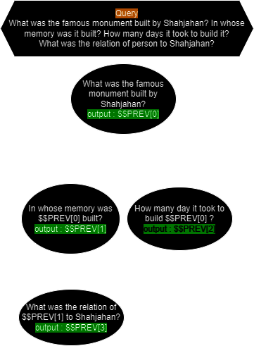
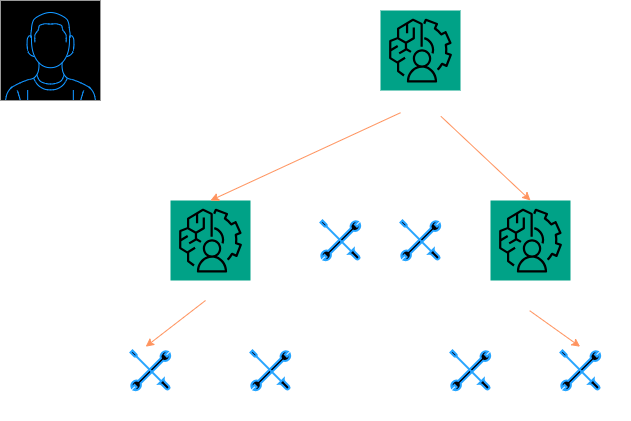
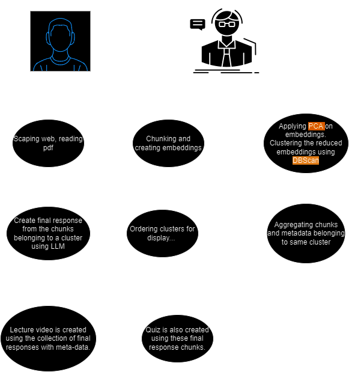
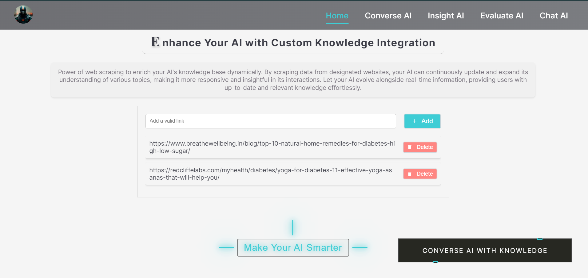
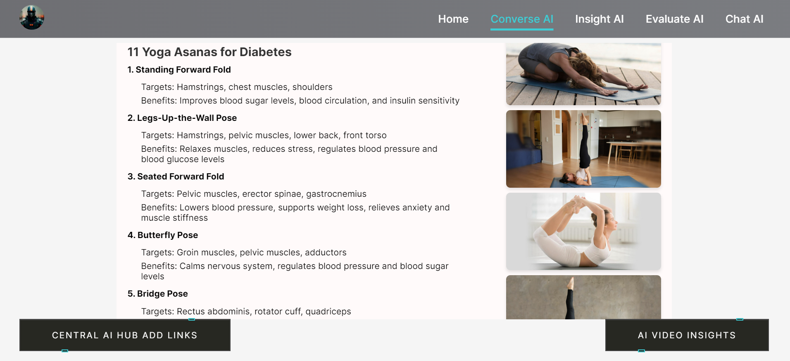
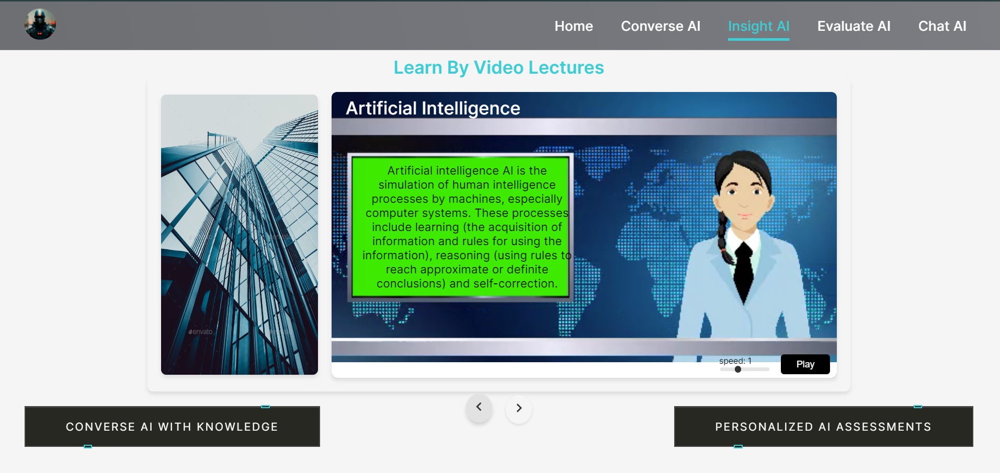
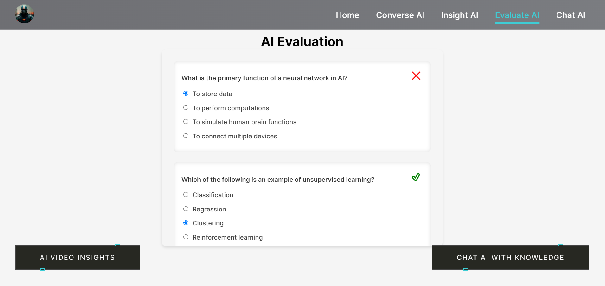
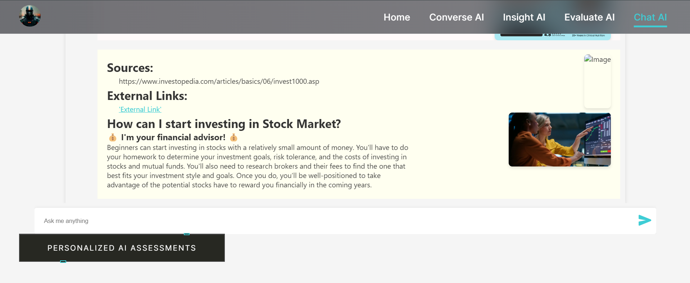

# Cleverchat

[![Contributors][contributors-shield]][contributors-url]
[![Forks][forks-shield]][forks-url]
[![Stargazers][stars-shield]][stars-url]
[![Issues][issues-shield]][issues-url]
[![MIT License][license-shield]][license-url]

<br />
<div align="center">
<a href="https://github.com/Sar2580P/cleverchat">
   
</a>
<h2 align="center">Cleverchat</h2>

  <p align="center">
   AI-driven app with smart navigation, interactive chatbot, insightful videos, and personalized assessments.
    <br />
    <br />
    <a href="https://github.com/Sar2580P/cleverchat/issues">Report Bug</a>
    ·
    <a href="https://github.com/Sar2580P/cleverchat/issues">Request Feature</a>
  </p>
</div>

## About The Project

The Learning App is designed to provide a personalized educational experience. Users can input links to resources they want to learn from, and the LLM will update its knowledge base accordingly. The app offers various features, including reading generated pages, learning through video lectures, taking tests, and chatting with the AI.

<p align="right">(<a href="#readme-top">back to top</a>)</p>

### Built With

- [![react][react]][react-url]
- [![next][next]][next-url]
- [![typescript][typescript]][typescript-url]
- [![django][django]][django-url]
- [![VisualStudioCode][VisualStudioCode]][VisualStudioCode-url]

<p align="right">(<a href="#readme-top">back to top</a>)</p>

## Getting Started

So as to run our project locally, you need to follow the steps below.

### Installation

1. Clone the repository:

   ```sh
   https://github.com/Sar2580P/cleverchat.git
   cd cleverchat
   ```

2. Install dependencies for the frontend (Next.js):

   ```sh
   cd web
   npm install
   ```

3. Install dependencies for the backend (Django):

   ```sh
   cd ../api
   python3 -m venv .venv
   source .venv/bin/activate
   pip install -r requirements.txt
   ```

4. Run the development servers:

   - For Next.js (frontend):
     ```sh
     cd web
     npm run build
     npm start
     ```
   - For Django (backend):
     ```sh
     cd ../api
     python manage.py runserver
     ```

5. Open your browser and navigate to `http://localhost:3000` for the frontend and `http://127.0.0.1:8000/api` for the backend admin interface.

<p align="right">(<a href="#readme-top">back to top</a>)</p>

<!-- USAGE EXAMPLES -->

## Description

The Learning App is designed to provide a personalized educational experience. Users can input links to resources they want to learn from, and the LLM will update its knowledge base accordingly. The app offers various features, including reading generated pages, learning through video lectures, taking tests, and chatting with the AI.</br>

## Problem

- **Un-Interactive Bots:** Many service bots today only respond in plain text, which can make interactions feel less engaging.

- **Upper-Bound on Agent Tools:** Having too many tools available can overwhelm agents and potentially degrade their performance.

- **Reading is Tough:** Users often prefer engaging content formats, such as videos or interactive media, over lengthy text-based content like blogs.

- **Maintenance of Tools:** Agents are provided with a static list of tools for each query, which can lead to inefficiencies if the tools are not updated or optimized based on the query's context.

- **Increasing Context Length Unnecessarily:** Expanding the context length without necessity can negatively impact the system's performance and efficiency.

## Solution



### Directed Acyclic Graph (DAG) for Queries

- Each query is a directed acyclic graph (DAG) in itself.
- Certain parts of the query contribute to answering other parts.
- This idea allows segmenting the query into directed sub-tasks.
- Solve and get the final response for each task topologically, enriching each segment with metadata like associated images, web-links, etc.
- Serve the final response as a concatenation of enriched responses from each node in the graph.

## Approach



### Agent Hierarchy

- Each agent has a set of agents and tools available to it, similar to how a prime minister has a set of ministers under them.
- This hierarchical structure helps manage tasks efficiently.

### DAG Module

- Each agent has a module for creating a directed acyclic graph.
- The DAG module establishes the relationship between the input/output of tools and agents.

### Agent Runner

- After exploring connectivity using the DAG module, each tool is run in a topological manner.
- The output of a parent tool node is available to children as context in their prompt.

### Node-Level Response

- Each node in the graph is either a tool or another agent itself.
- Each node handles contrastive parts of the original query and returns a response along with metadata (image-links, etc.).

## A Tool: Teacher



### Knowledge Ingestion

- Just provide the sources to build knowledge from, such as PDFs or web-links.

### Making Lecture Notes

- Performs chunking and embedding on documents.
- Applies PCA on embeddings and clusters the reduced embeddings.
- Orders clusters to maintain the flow of thoughts.

### Video Lecture

- Provides a video lecture to assist in understanding concepts.

### Organizing Quiz

- Provides an objective quiz to test understanding of the concept.

## Key Features

- **Home Page**: Add links to update the LLM's knowledge base.
- **Converse AI**: Access new pages generated by the LLM from the provided links.
- **Insight AI**: Learn through video lectures.
- **Evaluate AI**: Take tests generated by the LLM.
- **Chat AI**: Chat with the AI based on updated knowledge and general information.

## Pages Overview

### Home Page



The starting point of the application where users can input links to resources. These links will be used to update the LLM's knowledge base, ensuring that the AI is up-to-date with the latest information provided by the user.

### Converse AI



A section where users can read new pages generated by the LLM from the links provided on the Home Page. This allows users to stay updated with the latest information and insights derived from their specified sources.

### Insight AI



This page features video lectures that facilitate learning. Users can watch educational videos tailored to the topics they've provided, making learning more interactive and engaging.

### Evaluate AI



Users can take tests generated by the LLM on this page. The tests are designed to evaluate the user's understanding of the material provided in the links, helping users to assess their knowledge and progress.

### Chat AI



A chat interface where users can interact with the AI. The AI uses the updated knowledge base to answer questions and provide information, making it a valuable tool for learning and general inquiries.

<p align="right">(<a href="#readme-top">back to top</a>)</p>

<!-- CONTRIBUTING -->

## Contributing

Contributions are what make the open source community such an amazing place to learn, inspire, and create. Any contributions you make are greatly appreciated.

If you have a suggestion that would make this better, please fork the repo and create a pull request. You can also simply open an issue with the tag "enhancement".
Don't forget to give the project a star! Thanks again!

1. Fork the Project
2. Create your Feature Branch (`git checkout -b feature/AmazingFeature`)
3. Commit your Changes (`git commit -m 'Add some AmazingFeature'`)
4. Push to the Branch (`git push origin feature/AmazingFeature`)
5. Open a Pull Request

<p align="right">(<a href="#readme-top">back to top</a>)</p>

<!-- CONTACT -->

## Acknowledgments

Use this space to list resources you find helpful and would like to give credit to. I've included a few of my favorites to kick things off!

- [GitHub Pages](https://pages.github.com)
- [Font Awesome](https://fontawesome.com)

A special thank you to all the current contributors who have made this project possible. You can view the contributors

- [Sar2580P](https://github.com/Sar2580P).
- [Shivam kumar](https://github.com/shivam6862)

<p align="right">(<a href="#readme-top">back to top</a>)</p>

[contributors-shield]: https://img.shields.io/github/contributors/Sar2580P/cleverchat.svg?style=for-the-badge
[contributors-url]: https://github.com/Sar2580P/cleverchat/graphs/contributors
[forks-shield]: https://img.shields.io/github/forks/Sar2580P/cleverchat.svg?style=for-the-badge
[forks-url]: https://github.com/Sar2580P/cleverchat/network/members
[stars-shield]: https://img.shields.io/github/stars/Sar2580P/cleverchat.svg?style=for-the-badge
[stars-url]: https://github.com/Sar2580P/cleverchat/stargazers
[issues-shield]: https://img.shields.io/github/issues/Sar2580P/cleverchat.svg?style=for-the-badge
[issues-url]: https://github.com/Sar2580P/cleverchat/issues
[license-shield]: https://img.shields.io/github/license/Sar2580P/cleverchat.svg?style=for-the-badge
[license-url]: https://github.com/Sar2580P/cleverchat/blob/master/LICENSE.txt
[linkedin-shield]: https://img.shields.io/badge/-LinkedIn-black.svg?style=for-the-badge&logo=linkedin&colorB=555
[linkedin-url]: https://linkedin.com/
[react]: https://img.shields.io/badge/React-20232A?style=for-the-badge&logo=react&logoColor=61DAFB
[react-url]: https://react.dev/
[VisualStudioCode]: https://img.shields.io/badge/Made%20for-VSCode-1f425f.svg
[VisualStudioCode-url]: https://code.visualstudio.com/
[nodejs-url]: https://nodejs.org/en
[nodejs]: https://img.shields.io/badge/Node.js-43853D?style=for-the-badge&logo=node.js&logoColor=white
[mongodb-url]: https://www.mongodb.com/
[mongodb]: https://img.shields.io/badge/MongoDB-4EA94B?style=for-the-badge&logo=mongodb&logoColor=white
[next-url]: https://nextjs.org/docs
[next]: https://img.shields.io/badge/next.js-000000?style=for-the-badge&logo=nextdotjs&logoColor=white
[reduxjs-url]: https://redux.js.org/
[reduxjs]: https://img.shields.io/badge/Redux-593D88?style=for-the-badge&logo=redux&logoColor=white
[typescript-url]: https://www.typescriptlang.org/docs/handbook/typescript-in-5-minutes.html
[typescript]: https://img.shields.io/badge/TypeScript-007ACC?style=for-the-badge&logo=typescript&logoColor=white
[django]: https://img.shields.io/badge/Django-092E20?style=for-the-badge&logo=django&logoColor=white
[django-url]: https://docs.djangoproject.com/en/5.0/
